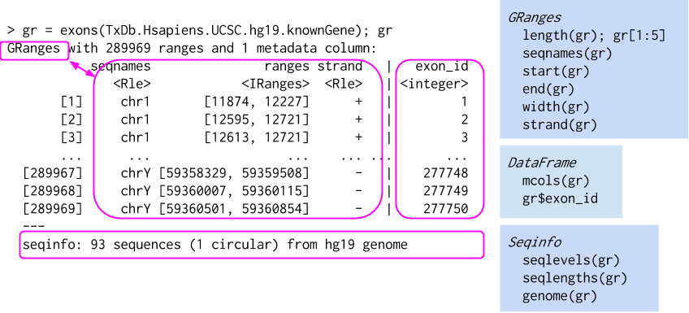
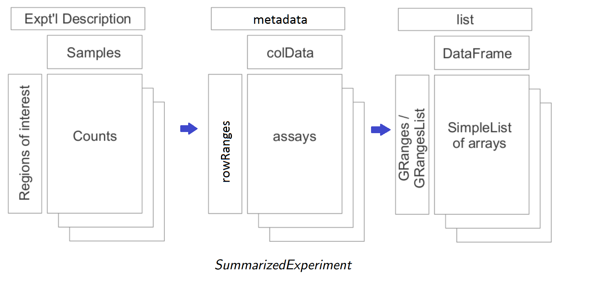

```{r style, echo = FALSE, results = 'asis'}
BiocStyle::markdown()
options(width=100, max.print=1000)
knitr::opts_chunk$set(
    eval=as.logical(Sys.getenv("KNITR_EVAL", "TRUE")),
    cache=as.logical(Sys.getenv("KNITR_CACHE", "TRUE")))
```
Author: Sonali Arora (<a
  href="mailto:sarora@fredhutch.org">sarora@fredhutch.org</a>)<br/ >
Date: 20-22 July, 2015<br />

The material in this course requires R version 3.2.1 and Bioconductor
version 3.2


## What is Bioconductor 

Analysis and comprehension of high-throughput genomic data

- Statistical analysis: large data, technological artifacts, designed
  experiments; rigorous
- Comprehension: biological context, visualization, reproducibility
- High-throughput
    + Sequencing: RNASeq, ChIPSeq, variants, copy number, ...
    + Microarrays: expression, SNP, ...
    + Flow cytometry, proteomics, images, ...

Packages, vignettes, work flows

- 'Release' (every six months) and 'devel' branches
- Choose from 1045 packages.
     + Discover packages via 
     [biocViews](http://bioconductor.org/packages/devel/BiocViews.html#___Software)
     + Each Package has a Package 'landing page' with Title, 
       author / maintainer, short description, citation, 
       installation instructions, shields, documentation, download statistics 
     + All user-visible functions have help pages, most with runnable examples
     + 'Vignettes' an important feature in Bioconductor -- narrative
       documents illustrating how to use the package, with integrated code

Helpful Links  

- Documentation
[Previous Course Material](http://bioconductor.org/help/course-materials/),
[Workflows](http://bioconductor.org/help/workflows/),
[Videos](https://www.youtube.com/user/bioconductor),
[Developers](http://bioconductor.org/developers/) 
- Ask a question 
[Support site](https://support.bioconductor.org) 
- Connect with us 
[Twitter](https://twitter.com/Bioconductor), 
[Newsletter](http://bioconductor.org/help/newsletters/2015_July/)


## Overall Workflow 

A typical workflow consists of the following steps.  
- Experimental design  
- Wet-lab preparation  
- High-throughput sequencing  
    + Output: FASTQ files of reads and their quality scores  
- Alignment
    + Many different aligners, some specialized for different purposes  
    + Output: BAM files of aligned reads  
- Summary  
    + e.g., _count_ of reads overlapping regions of interest (e.g., genes)  
- Statistical analysis  
- Comprehension  


## Where does Bioconductor fit in 

### I. Infrastructure

One of the biggest strengths of Bioconductor is the classes defined to make 
simple tasks extremely easy and streamlined. 

#### 1. `GenomicRanges` objects 

- Represent **annotations** -- genes, variants, regulatory elements,
  copy number regions, ...
- Represent **data** -- aligned reads, ChIP peaks, called variants,
  ...



Many biologically interesting questions represent operations on ranges

- Count overlaps between aligned reads and known genes --
  `GenomicRanges::summarizeOverlaps()`
- Genes nearest to regulatory regions -- `GenomicRanges::nearest()`,
  [ChIPseeker][]
- Called variants relevant to clinical phenotypes -- 
  [VariantFiltering][]

_GRanges_ Algebra

- Intra-range methods
    - Independent of other ranges in the same object
    - GRanges variants strand-aware
    - `shift()`, `narrow()`, `flank()`, `promoters()`, `resize()`,
      `restrict()`, `trim()`
    - See `?"intra-range-methods"`
- Inter-range methods
    - Depends on other ranges in the same object
    - `range()`, `reduce()`, `gaps()`, `disjoin()`
    - `coverage()` (!)
    - see `?"inter-range-methods"`
- Between-range methods
    - Functions of two (or more) range objects
    - `findOverlaps()`, `countOverlaps()`, ..., `%over%`, `%within%`,
      `%outside%`; `union()`, `intersect()`, `setdiff()`, `punion()`,
      `pintersect()`, `psetdiff()`

#### 2. SummarizedExperiment 

The SummarizedExperiment class is a matrix-like container where
     rows represent ranges of interest (as a ‘GRanges or
     GRangesList-class’) and columns represent samples (with sample
     data summarized as a ‘DataFrame-class’)



### II. Reading in Various file formats using R/Bioconductor


__Example - Reading in BAM files__   
  The `r Biocpkg("GenomicAlignments")` package is used to input reads
  aligned to a reference genome. In this next example, we will read
  in a BAM file and specifically read in reads supporting an apparent   
  exon splice junction spanning position 19653773 of chromosome 14.

  The package `r Biocexptpkg("RNAseqData.HNRNPC.bam.chr14_BAMFILES")`
  contains 8 BAM files. We will use only the first BAM file. We will
  load the software packages and the data package, construct a _GRanges_
  with our region of interest, and use `summarizeJunctions()` to find
  reads in our region of interest.

```{r}
## 1. load software packages
library(GenomicRanges)
library(GenomicAlignments)

## 2. load sample data
library('RNAseqData.HNRNPC.bam.chr14')
bf <- BamFile(RNAseqData.HNRNPC.bam.chr14_BAMFILES[[1]], asMates=TRUE)

## 3. define our 'region of interest'
roi <- GRanges("chr14", IRanges(19653773, width=1))

## 4. alignments, junctions, overlapping our roi
paln <- readGAlignmentsList(bf)
j <- summarizeJunctions(paln, with.revmap=TRUE)
j_overlap <- j[j %over% roi]

## 5. supporting reads
paln[j_overlap$revmap[[1]]]
```

### III. Annotations 

#### __1. AnnotationHub: Bioconductor Package to Manage & Download files__
 `r Biocpkg("AnnotationHub")` is a web client with which one can browse and   
 download biological files from various databases such as UCSC, NCBI.   
 Using this package allows the user to directly get the file, without needing   
 to figure out where the file is located on UCSC, downloading it and managing   
 multiple files on their local machine.   
 
 ```{r ah-demo}
 library(AnnotationHub)
 ah = AnnotationHub()
 
 ## data is available from the following sources
 unique(ah$dataprovider)
 
 ## following types of files can be retrieved from the hub 
 unique(ah$sourcetype)
 
 ## We will download all _Homo sapiens_ cDNA sequences from the FASTA file
 ## 'Homo_sapiens.GRCh38.cdna.all.fa' from Ensembl using
 ## `r Biocpkg("AnnotationHub")`.
 ah2 <- query(ah, c("fasta", "homo sapiens", "Ensembl"))
 fa <- ah2[["AH18522"]]
 fa
  ```

#### __2. `TxDb` objects__

- Curatated annotation resources -- http://bioconductor.org/packages/biocViews
- Underlying sqlite database -- `dbfile(txdb)`
- Make your own: `GenomicFeatures::makeTxDbFrom*()`
- Accessing gene models
    - `exons()`, `transcripts()`, `genes()`, `cds()` (coding sequence)
    - `promoters()` & friends
    - `exonsBy()` & friends -- exons by gene, transcript, ...
    - 'select' interface: `keytypes()`, `columns()`, `keys()`, `select()`,
  `mapIds()`

```{r gene-model-discovery}
library("TxDb.Hsapiens.UCSC.hg19.knownGene")
txdb <- TxDb.Hsapiens.UCSC.hg19.knownGene
txdb
methods(class=class(txdb))
genes(txdb)
```
#### __3.`OrgDb` objects__

- Curated resources, underlying sqlite data base, like `TxDb`
- 'select' interface: `keytypes()`, `columns()`, `keys()`, `select()`,
  `mapIds()`
- Vector of keys, desired columns
- Specification of key type
```{r select}
library(org.Hs.eg.db)
select(org.Hs.eg.db, c("BRCA1", "PTEN"), c("ENTREZID", "GENENAME"), "SYMBOL")
keytypes(org.Hs.eg.db)
columns(org.Hs.eg.db)
```
#### __4. Other internet resources__

- [biomaRt](http://biomart.org)                       Ensembl and other annotations
- [PSICQUIC](https://code.google.com/p/psicquic)      Protein interactions
- [uniprot.ws](http://uniprot.org)                    Protein annotations
- [KEGGREST](http://www.genome.jp/kegg)               KEGG pathways
- [SRAdb](http://www.ncbi.nlm.nih.gov/sra)            Sequencing experiments
- [rtracklayer](http://genome.ucsc.edu)               USCS genome tracks
- [GEOquery](http://www.ncbi.nlm.nih.gov/geo/)        Array and other data
- [ArrayExpress](http://www.ebi.ac.uk/arrayexpress/)  Array and other data
- ...

### IV. Statistical Analysis 

_Bioconductor_ packages are organized by
[biocViews](http://bioconductor.org/packages/devel/BiocViews.html#___Software). 
One can answer a number of [Biological Questions](http://bioconductor.org/packages/devel/BiocViews.html#___BiologicalQuestion) 
using various packages. Some of the entries under
[Sequencing](http://bioconductor.org/packages/biocViews.html#__Sequencing)
and other terms, and representative packages, include:

* [RNASeq](http://bioconductor.org/packages/biocViews.html#__RNASeq),
   e.g., `r Biocpkg("edgeR")`, `r Biocpkg("DESeq2")`,
   `r Biocpkg("edgeR")`, `r Biocpkg("derfinder")`, and
   `r Biocpkg("QuasR")`.

* [ChIPSeq](http://bioconductor.org/packages/biocViews.html#__ChIPSeq),
  e.g.,`r Biocpkg("DiffBind")`, `r Biocpkg("csaw")`, `r Biocpkg("ChIPseeker")`,
  `r Biocpkg("ChIPQC")`.

* [SNPs](http://bioconductor.org/packages/biocViews.html#__SNP) and
  other variants, e.g., `r Biocpkg("VariantAnnotation")`,
  `r Biocpkg("VariantFiltering")`, `r Biocpkg("h5vc")`.

* [CopyNumberVariation](http://bioconductor.org/packages/biocViews.html#__CopyNumberVariation)
  e.g., `r Biocpkg("DNAcopy")`, `r Biocpkg("crlmm")`, `r Biocpkg("fastseg")`.

* [Microbiome](http://bioconductor.org/packages/biocViews.html#__Microbiome)
  and metagenome sequencing, e.g., `r Biocpkg("metagenomeSeq")`,
  `r Biocpkg("phyloseq")`, `r Biocpkg("DirichletMultinomial")`.


## `sessionInfo()`

```{r sessionInfo}
sessionInfo()
```


  
